# Differentiable Patch-Match

##### Table of Contents  
[Patch Match](#PatchMatch)  
[Differentiable Patch Match](#DifferentiablePatchMatch)  
[Differentiable Patch Match vs Patch Match for Image Reconstruction](#Comparison)  
[Run Command](#run_command)  
[Citation](#citation)  

## PatchMatch

Patch Match ([Barnes et al.](https://gfx.cs.princeton.edu/pubs/Barnes_2009_PAR/)) was originally introduced as an efficient way to find dense correspondences across images for structural editing. The key idea behind it is that, a **large number of random samples often lead to good guesses**. Additionally, **neighboring pixels usually have coherent matches**. Therefore, once a good match is found, it can efficiently propagate the information to the neighbors.

| **Patch Match Overview**                                     | **Patch Match Steps**                                        |
| :----------------------------------------------------------- | ------------------------------------------------------------ |
| 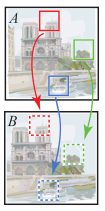 | 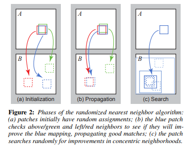 |

## Differentiable PatchMatch 

1. In our work, we unroll generalized **PatchMatch as a recurrent neural network**, where each unrolling step is equivalent to each iteration of the algorithm. **This is important as it allow us to train our full model end-to-end. **
2. Specifically, we design the following layers:
   1. **Particle sampling layer**: for each pixel i, we randomly generate k disparity values from the uniform distribution over predicted/pre-defined search space.
   2. **Propagation layer**: particles from adjacent pixels are propagated together through convolution with a predefined one-hot filter pattern, which encodes the fact that we allow each pixel to propagate particles to its 4-neighbours.
   3.  **Evaluation layer**: for each pixel i, matching scores are computed by taking the inner product between the left feature and the right feature:  si,j; = <f0(i), f1(i + di,j)>. The best k disparity value for each pixel is carried towards the next iteration

We replace the non-differentiable argmax during evaluation with differentiable softmax.

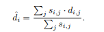

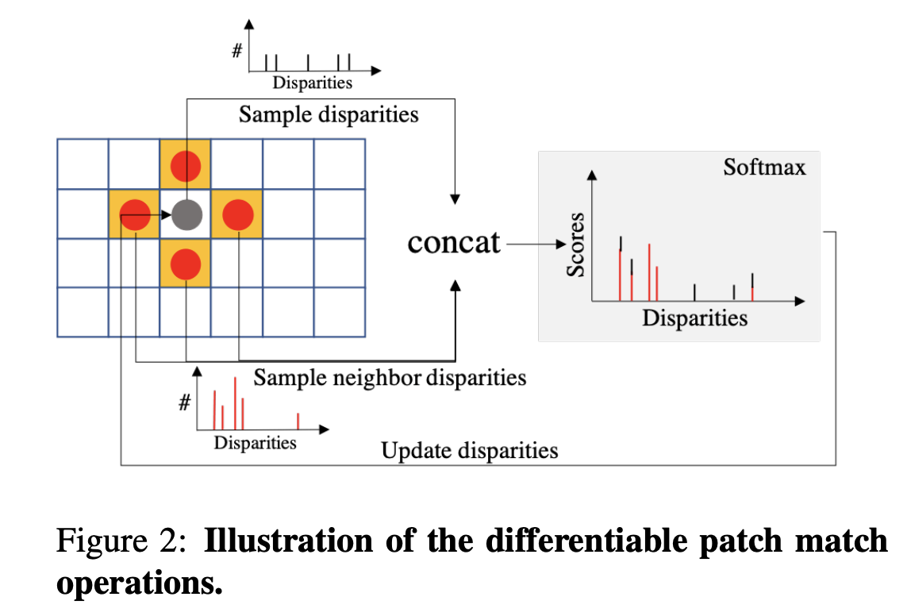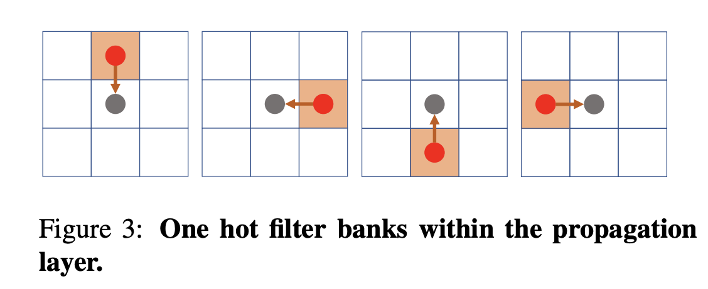

   

3. For usage of Differentiable Patch Match for stereo matching, refer to out paper.

## Differentiable Patch Match vs Patch Match for Image Reconstruction

1.  In this section, we compare the proposed Differentiable Patch Match with the original Patch Match for the image reconstruction task.
2.  Given two images, Image A and Image B,  we reconstruct Image A from Image B, based on **Differentiable PatchMatch / PatchMatch** "A-to-B" dense patch mappings.
3. Following are the per-iteration comparison results between the Differentiable Patch Match and the original Patch Match.

&nbsp;
&nbsp;
&nbsp;
&nbsp;
&nbsp;
&nbsp;
&nbsp;
&nbsp;

### *Images*

| Image A | Image B |
| :-----: | :-----: |
|          |          |
|          |          |
|          |          |
| 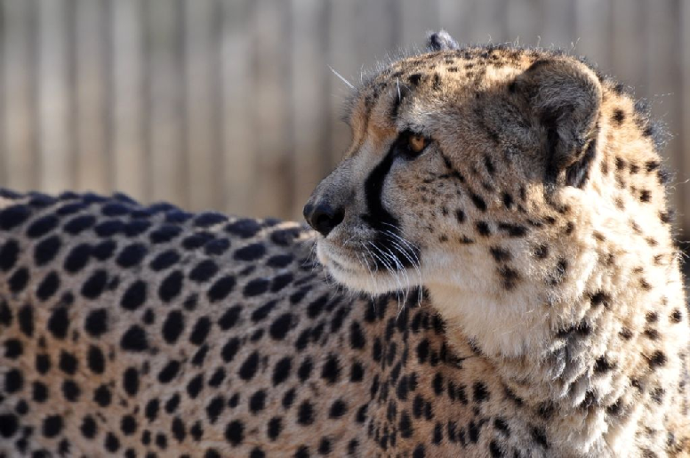         |  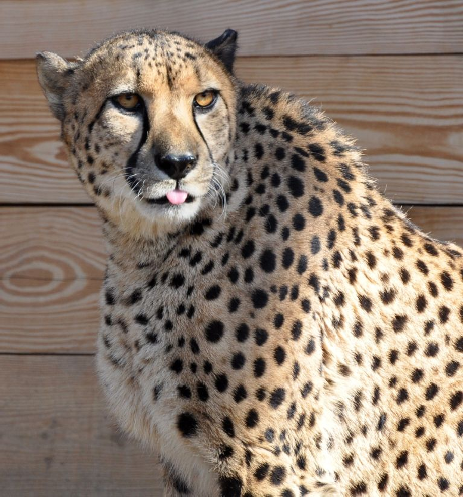        |
| 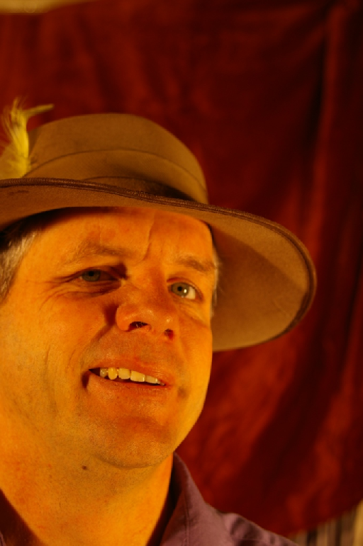         |  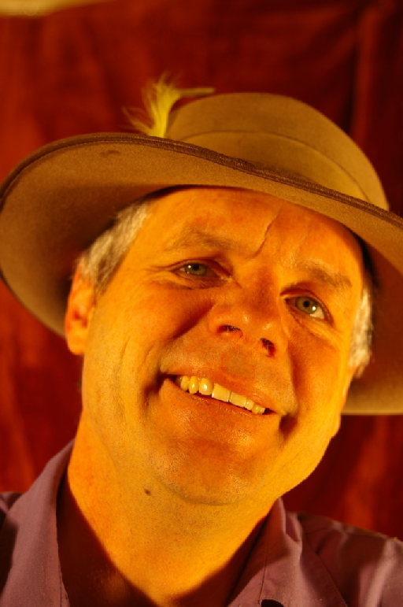        |

&nbsp;
&nbsp;
&nbsp;
&nbsp;
&nbsp;
&nbsp;
&nbsp;
&nbsp;

### *Reconstructed A from B*

| Differentiable Patch Match | Patch Match |
| :-----: | :-----: |
|          |       |
|          |          |
|          |          |
| 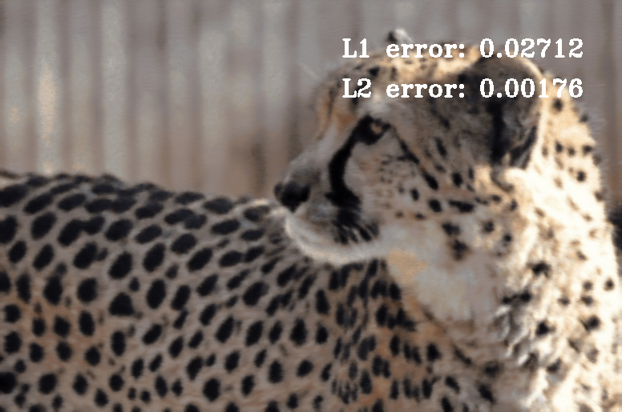         |          |
| 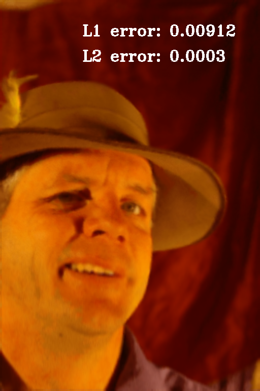         |    |

&nbsp;
&nbsp;
&nbsp;
&nbsp;
&nbsp;
&nbsp;
&nbsp;
&nbsp;

### RUN COMMAND

1. Create a base_dir with two folders:
	base_directory
	|----- image_1
	|---- image_2
	
	
	
	> python demo_script.py  \
	> --base_dir <base_directory >
	> --save_dir < save directory for reconstructed images>

## Citation

If you use our source code, or our paper, please consider citing the following:

> @inproceedings{Duggal2019ICCV,  
> title = {DeepPruner: Learning Efficient Stereo Matching  via Differentiable PatchMatch},  
> author = {Shivam Duggal and Shenlong Wang and Wei-Chiu Ma and Rui Hu and Raquel Urtasun},  > 
> booktitle = {ICCV},  
> year = {2019}
> }

Correspondences to Shivam Duggal <shivamduggal.9507@gmail.com>, Shenlong Wang <slwang@cs.toronto.edu>, Wei-Chiu Ma <weichium@mit.edu>
