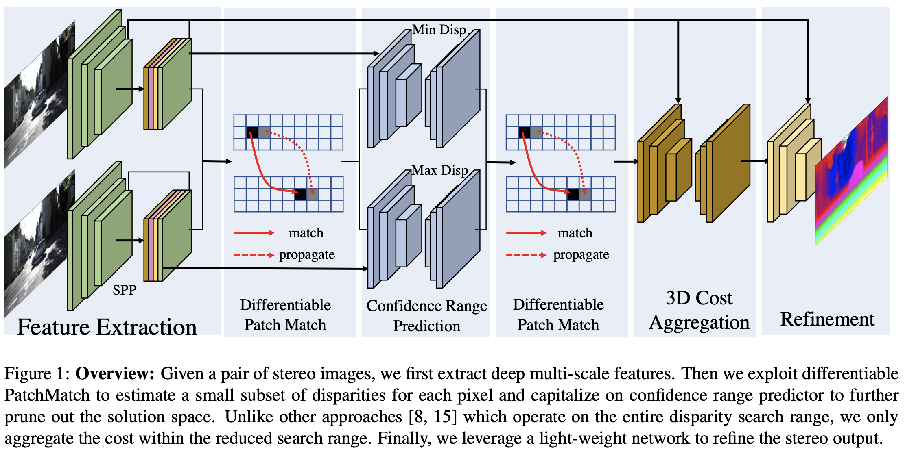
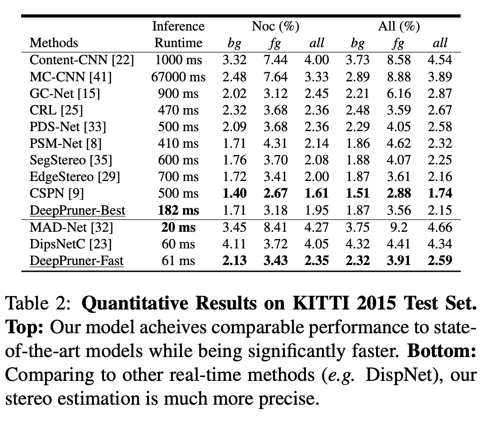
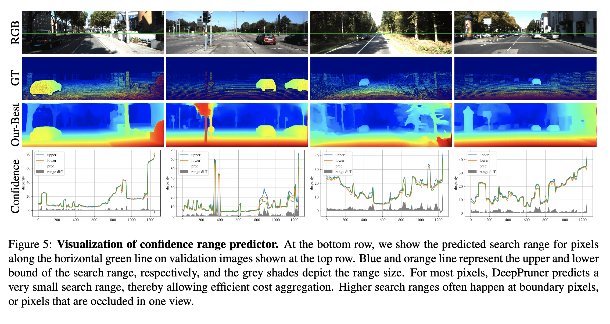
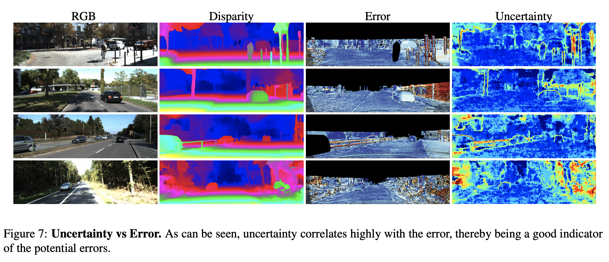
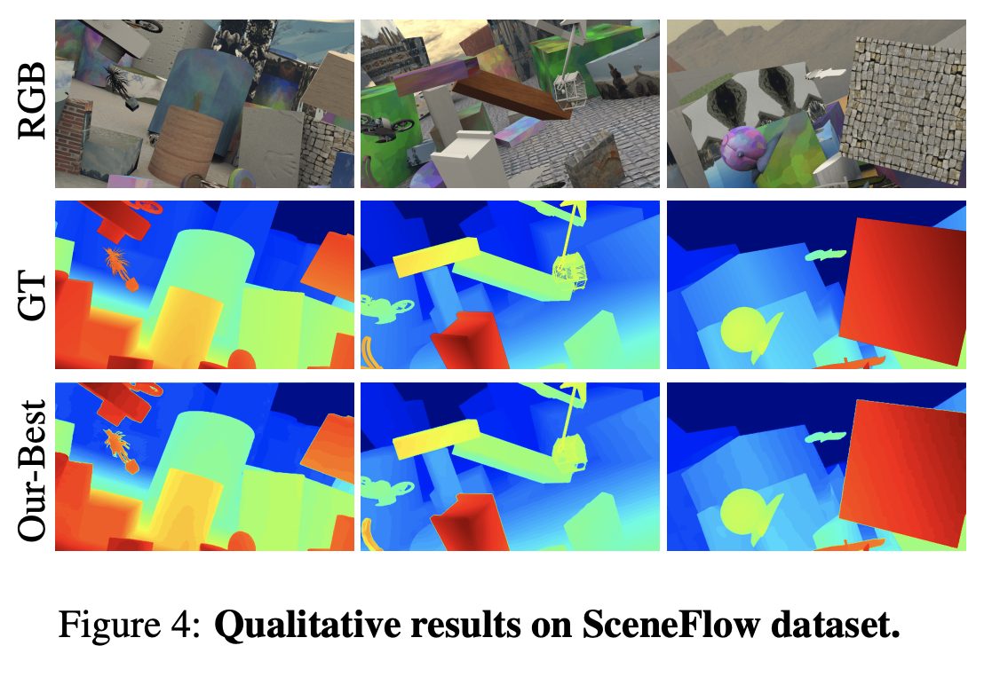
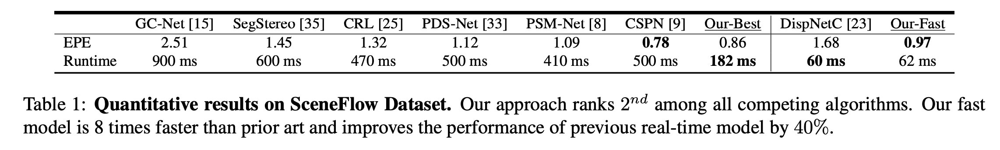
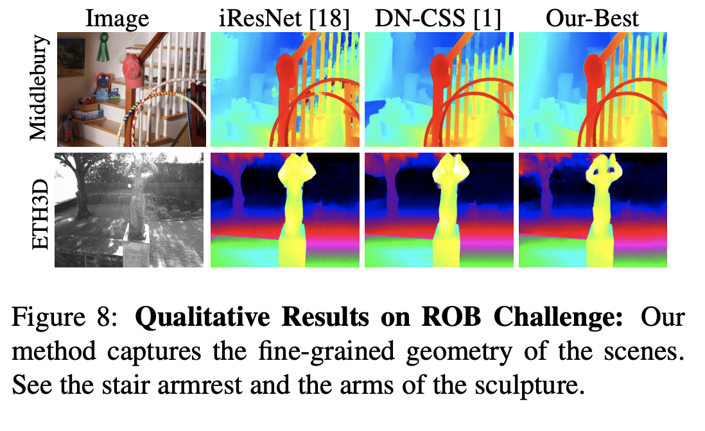
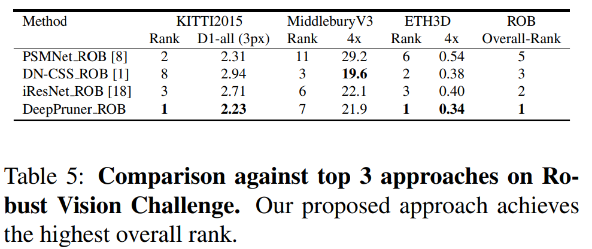

# DeepPruner

This is the code repository for **DeepPruner: Learning Efficient Stereo Matching via Differentiable PatchMatch**.

##### Table of Contents  

[Requirements](#Requirements)  
[License](#License)   
[Model Weights](#Weights)    
[Training and Evaluation](#TrainingEvaluation) 
- [KITTI](#KITTI) 
- [Sceneflow](#Sceneflow) 
- [Robust Vision Challenge](#ROB) 

## Requirements

+ Pytorch (0.4.0+)
+ python (2.7)
+ scikit-image
+ tensorboardX
+ torchvision (0.2.0+)

## License

+ The souce code for DeepPruner and Differentiable PatchMatch are released under the <a href="https://github.com/uber-research/DeepPruner/blob/master/LICENSE"> © Uber, 2018-2019. Licensed under the Uber Non-Commercial License.</a>
+ The trained model-weights for DeepPruner are released under the license <a href="https://creativecommons.org/licenses/by-nc-sa/3.0/">Creative Commons Attribution-NonCommercial-ShareAlike 3.0 License.</a>

##  Model Weights

DeepPruner was first trained on Sceneflow dataset and then finetuned on KITTI (Combined 394 images of KITTI-2012 and KITTI-2015) dataset.

+ <a href="https://drive.google.com/open?id=1jJAawAUcTpmhj8YdG7BWonglKpfQ8oMN">DeepPruner-fast (KITTI)</a>
+ <a href="https://drive.google.com/open?id=1mSendpKq0vdQMr5XVp5zAHm37dwEgcun">DeepPruner-best (KITTI)</a>
+ <a href="https://drive.google.com/open?id=1n5lhhFDb07s6NtlLG8_pnnfwI7bLnSVx">DeepPruner-fast (Sceneflow)</a>
+ <a href="https://drive.google.com/open?id=1y6V9A4B4LlrkIMflgcykNgD0oQwUf7AC">DeepPruner-best (Sceneflow)</a>

## Training and Evaluation

**NOTE:** We allow the users to modify a bunch of model parameters and training setting for their own purpose. You may need to retain the model with the modified parameters.
Check **'models/config.py'** for more details. 

### KITTI Stereo 2012/2015:

KITTI 2015 has 200 stereo-pairs with ground truth disparities. We used 160 out of these 200 for training and the remaining 40 for validation. The training set was further augmented by 194 stereo image pairs from KITTI 2012 dataset.

#### Setup:

1. Download the KITTI 2012 and KITTI 2015 datasets.
2. Split KITTI Stereo 2015 training dataset into "training" (160 pairs) and "validation" (40 pairs), following the same directory structure as of the original dataset. **Make sure to have the following structure**:

  > training_directory_stereo_2015 \
  > |----- image_2 \
  > |----- image_3 \
  > |----- disp_occ_0 \
  > val_directory_stereo_2015 \
  > |----- image_2 \
  > |----- image_3 \
  > |----- disp_occ_0 \
  > train_directory_stereo_2012 \
  >       |----- colored_0 \
  >       |----- colored_1 \
  >       |----- disp_occ \
  > test_directory \
  >       |----- image_2 \
  >       |----- image_3

3. Note that, any other dataset could be used for training, validation and testing. The directory structure should be same.

#### Training Command:
1. Like previous works, we fine-tuned the pre-trained Sceneflow model on KITTI dataset.
2. Training Command:

   > python finetune_kitti.py \\\
   > --loadmodel <path_to_sceneflow_model> \\\
   > --savemodel <path_to_save_directory_for_trained_models> \\\
   > --train_datapath_2015 <training_directory_stereo_2015> \\\
   > --val_datapath_2015 <val_directory_stereo_2015>  \\\
   > --datapath_2012 <directory_stereo_2012>

3. Training command arguments:

  + --loadmodel (default: None): If not set, the model would train from scratch.
  + --savemodel (default: './'): If not set, the script will save the trained models after every epoch in the same directory.
  + --train_datapath_2015 (default: None): If not set, KITTI stereo 2015 dataset won't be used for training.
  + --val_datapath_2015 (default: None): If not set, the script would fail. The validation dataset should have atleast one image to run.
  + --datapath_2012 (default: None): If not set, KITTI stereo 2012 dataset won't be used for training.4. Training and validation tensorboard runs will be saved in **'./runs/' directory**.

#### Evaluation Command (On Any Dataset):
1. We used KITTI 2015 Stereo testing set for evaluation. **(Note any other dataset could be used.)**
2. To evaluate DeepPruner on any dataset, just create a base directory like:	
  > test_directory \
  >       |----- image_2 \
  >       |----- image_3

image_2 folder holds the left images, while image_3 folder holds the right images.

3. For evaluation, update the "mode" parameter in "models.config.py" to "evaluation".

4. Evaluation command:

   > python submission_kitti.py \
   > --loadmodel <path_to_trained_model> \
   > --save_dir <director_to_store_disparity_output> \
   > --datapath <test_directory>  

#### Metrics/ Results:

1. The metrics used for evaluation are same as provided by the [KITTI Stereo benchmark](http://www.cvlibs.net/datasets/kitti/eval_scene_flow.php?benchmark=stereo).
2. The quantitaive results obtained by DeepPruner are as follows: (Note the standings in the Tables below are at the time of March 2019.)

3. Alongside learning the disparity (or depth maps), DeepPruner is able to predict the uncertain regions (occluded regions , bushy regions, object edges) efficiently .  Since the uncertainty in prediction correlates well with the error in the disparity maps (Figure 7.), such uncertainty can be used in other downstream tasks.

4. Qualitative results are as follows:

   
     
   

### Sceneflow:

#### Setup:

1. Download [Sceneflow dataset](https://lmb.informatik.uni-freiburg.de/resources/datasets/SceneFlowDatasets.en.html#downloads), which consists of FlyingThings3D, Driving and Monkaa (RGB images (cleanpass) and disparity).

2. We followed the same directory structure as of the downloaded data. Check **dataloader/sceneflow_collector.py**.

#### Training/ Evaluation Command:

> python train_sceneflow.py \\\
> --loadmodel <path_to_trained_model> \\\
> --save_dir <directory_to_store_disparity_output> \\\
> --savemodel <directory_to_store_trained_models_every_epoch> \\\
> --datapath_monkaa <monkaa_dataset> \\\
> --datapath_flying <flying_things> \\\
> --datapath_driving <driving_dataset>	

#### Metrics/ Results:

1. We used EPE(end point error) as one of the metrics.

  

  
  

  

  
  

   

### Robust Vision Challenge:

#### Details:

1. The goal of Robust Vision Challenge challenge is to foster the development of vision systems that are robust and 
   consequently perform well on a variety of datasets with different characteristics.
   Please refer to <a href="http://www.robustvision.net/"> Robust Vision Challenge </a> for more details.

2. We used the pre-trained Seneflow model and then jointly fine-tuned the model on KITTI, ETH3D and Middlebury datasets.

#### Setup

1. Dataloader and setup details coming soon.

#### Metrics/ Results:

Check <a href="http://www.cvlibs.net/datasets/kitti/eval_scene_flow_detail.php?benchmark=stereo&result=d67c3b20f7d2724e8d6a25f49405c0511f883b7a">DeepPruner_ROB</a> on KITTI benchmark. \
Check <a href="https://www.eth3d.net/low_res_two_view">DeepPruner_ROB</a> on ETH3D benchmark. \
Check <a href="http://vision.middlebury.edu/stereo/eval3/">DeepPruner_ROB</a> on MiddleburyV3 benchmark. \
    

  

  
  

  

  
  
